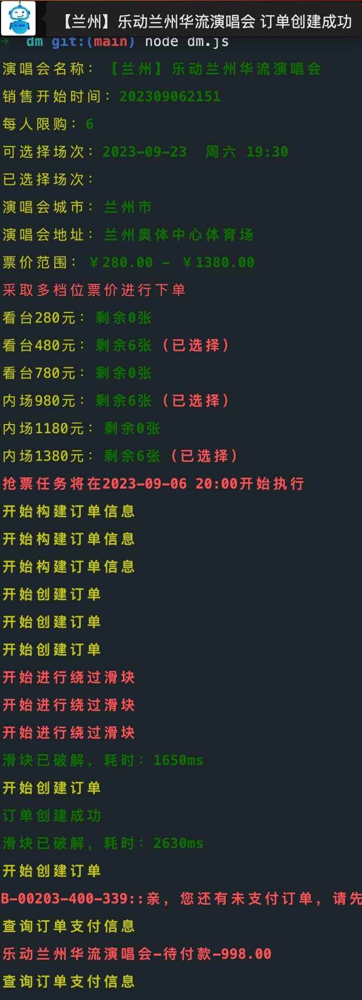

## Usage

-   步骤一：https://github.com/frida/frida/releases 下载 frida-server-16.1.3-android-x86_64.xz
-   步骤二：安卓模拟或真机安卓 root~执行./frida-server
-   步骤三：下载安卓大麦 apk 安装登录
-   步骤四：执行下面命令~over！

```shell
npm i // 安装依赖
node getSign.js || pip install && python getSign.py  // 搭建签名服务
node dm.js // 开抢脚本
```

### 功能

-   支持多选观影人
-   支持选择指定场次
-   支持选择指定票价档位
-   支持多档位票价同时下单
-   支持自动 or 手动过滑块
-   支持设定时间定时开抢
-   支持 5 分钟回流票查询抢购
-   支持下单成功后微信 bot 回调通知
-   支持多用户签名模式
-   支持 docker 容器并发

### 配置

```config.json
 {
    "itemId": "730268992754", // 演唱会项目id
    "selectedNum": "1", // 观影人
    "skuId": ["5059864464523"], // 选择票价档位
    "currentPerformId": ["211420082"], // 选择场次
    "dataType": 4,// 4代表场次1  2代表多场次
    "skuMore": true, // 多档位同时购买
    "auto": true, // 自动滑块
    "startTime": "2023-08-18 15:00", // 定时开抢
    "signHost": "http://localhost:8888/getSign", // 签名服务
    "user": 0, // 在模拟器多开大麦分身的时候用user来区分用户签名
    "wxNotify": "", // 微信机器人通知钩子函数
    "wxId": "xxxx" // 微信id
}
```

### Docker 构建

```docker
 # 构建镜像
 cd docker && docker image build ./ -t dm:latest
 # 导出镜像
 docker save -o dm.tar dm:latest
 # 导入镜像
 docker load < dm.tar
 # 启动容器
 docker compose up -d
```

### 运行结果

<center></center>

### 说明

垃圾代码(大热别想了)..仅供学习！！
